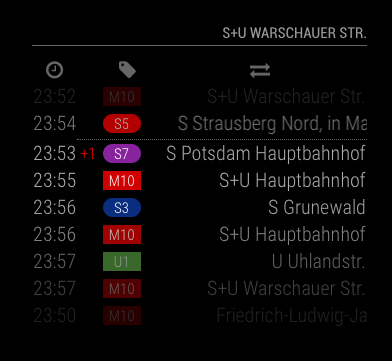

# MMM-PublicTransportBerlin

MMM-PublicTransportBerlin is a module for the [MagicMirror](https://github.com/MichMich/MagicMirror) project by [Michael Teeuw](https://github.com/MichMich).

It shows live public transport information for Berlin and Brandenburg based on [BVG-Hafas](https://github.com/derhuerst/bvg-rest) data. Public transport in Brandenburg should work as well.

MMM-PublicTransportBerlin uses the [hafas-client](https://github.com/public-transport/hafas-client) with a BVG-specific profile by [derhuerst](https://github.com/derhuerst).

You can enter a delay time for "How long does it take to get to my station?".
Then the module calculates the next reachable departures and draws a line between reachable and unreachable departures.

## Status

The current development status of this module is: **maintained**

This means: I'm open for feature requests, pull requests, bug reports, ...

## Screenshot

The module looks like this:



## Preconditions

- MagicMirror² instance
- Node.js version >= 14
- npm

## Installation

Just clone the module into your MagicMirror modules folder and execute `npm install` in the module's directory:

```console
git clone https://github.com/deg0nz/MMM-PublicTransportBerlin.git
cd MMM-PublicTransportBerlin
npm install
```

## Update

Just enter your MMM-PublicTransportBerlin folder in the MagicMirror's modules folder and execute the following commands in the module's directory:

```console
git pull && npm install
```

## How to get the `stationId`

You need the `stationId` for the station whose departures should be displayed.

Here's how to find out the `stationId`:

1. You have to be in the modules folder (`MagicMirror/modules/MMM-PublicTransportBerlin`).
2. Then run the following command: `npm run query_station`.
3. Enter a station name.
4. The result could contain one or more possible stations with valid IDs.
5. Use the appropriate ID as `stationId` in the configuration of the module.

_Note:_ If you have used our instructions to get the `stationId` befor March 2023, you certainly use long IDs (12 digits) in your config. We will be upgrading our main dependency (`hafas-client`) to version 6 in a few months. From this point on, the old (long) IDs will no longer work. We recommend that you switch to the short IDs now. Both short and long IDs currently work.

## Configuration

The module is quite configurable. These are the possible options:

<!-- prettier-ignore-start -->
| Option | Description |
|--------|-------------|
|`name`|The name of the module instance (if you want multiple modules). This value must be *unique*.<br><br>**Type:** `string` This value is **Required**.<br>|
|`stationId`|The ID of the station. How to get the ID for your station is described below.<br><br>**Type:** `string` This value is **Required**.|
|`directionStationId`|If you want the module to show departures only in a specific direction, you can enter the ID of the next station on your line to specify the direction. <br><br> *Note: After some tests, the data delivery of this feature seems not to be as reliable as the normal version. Also, please make sure you actually have the right `stationId` for the direction station. Please check your MagicMirror log for errors before reporting them. <br> Additionally, more request results take more time for the request. So please make sure to keep your `maxUnreachableDepartures` and `maxReachabledepartures` low when using this feature.* <br><br> **Type:** `string` <br>**Default value:** `<empty>`|
|`ignoredLines`|You can exclude different lines of a station by adding them to this array. Usually, this can be empty.<br><br>**Type:** `string array` (comma separated `strings` in the array).<br>**Default value:** `<empty>` <br>**Possible values:** All valid line names like `'U5'` (for subway) , `'M10'` or `'21'` (for tram), `'S75'` (for suburban) , `'Bus 200'`(for bus), etc.|
|`excludedTransportationTypes`|Transportation types to be excluded from appearing on a module instance can be listed here.<br><br>**Type:** `string`, comma-separated list<br>**Default vaule:** `<empty>` <br>**Possible values:** `bus`, `tram`, `suburban`, `subway`, `regional`, `ferry`|
|`marqueeLongDirections`|Makes a marquee/ticker text out of all direction descriptions with more than 25 characters. If this value is false, the descriptions are trimmed to the station names. You can see a video of it [here](https://ds.kayuk.de/kAfzU/) (rendered by a regular computer).<br><br> *Note: The rendering on the mirror is not perfect, but it is OK in my opinion. If the movement is not fluent enough for you, you should turn it off.*<br><br>**Type:** `boolean`<br>**Default vaule:** `true`|
|`interval`|How often the module should be updated. The value is given in milliseconds.<br><br>**Type:** `integer` (milliseconds)<br>**Default value:** `120000` (2 minutes)|
|`hidden`|Visibility of the module.<br><br>**Type:** `boolean`<br>**Default vaule:** `false`|
|`travelTimeToStation`|How long does it take you to get from the mirror to the station? The value is given in minutes. (this is the former `delay` option)<br><br>**Type:** `integer` (minutes)<br>**Default vaule:** `10` (10 minutes)|
|`departureMinutes`|For how many minutes in the future should departures be fetched? If `travelTimeToStation` is set > 0, then this time will be added to `now() + travelTimeToStation`. (This could be obsolete in future versions but is needed for now.)<br><br>**Type:** `integer` (minutes)<br>**Default vaule:** `10` (10 minutes)|
|`showColoredLineSymbols`|If you want the line colored and shaped or text only.<br><br>**Type:** `boolean`<br>**Default vaule:** `true`|
|`useColorForRealtimeInfo`|Set colors for realtime information<br><br>**Type:** `boolean`<br>**Default vaule:** `true`|
|`showTableHeaders`|Show or hides the table headers.<br><br>**Type:** `boolean`<br>**Default vaule:** `true`|
|`showTableHeadersAsSymbols`|Show the table headers as text or symbols.<br><br>**Type:** `boolean`<br>**Default vaule:** `true`|
|`maxUnreachableDepartures`|How many unreachable departures should be shown. Only necessary, of you set `travelTimeToStation` > 0<br><br>**Type:** `integer`<br>**Default vaule:** `3`|
|`maxReachableDepartures`|How many reachable departures should be shown. If your `travelTimeToSteation = 0`, this is the value for the number of departures you want to see.<br><br>**Type:** `integer`<br>**Default vaule:** `7`|
|`fadeUnreachableDepartures`|Activates/deactivates fading for unreachable departures.<br><br>**Type:** `boolean`<br>**Default vaule:** `true`|
|`fadeReachableDepartures`|Activates/deactivates fading for reachable departures.<br><br>**Type:** `boolean`<br>**Default vaule:** `true`|
|`fadePointForReachableDepartures`|Fading point for reachable departures. This value is also valid for `travelTimeToSteation == 0` <br><br>**Type:** `float`<br>**Default vaule:** `0.5` <br>**Possible values:** `0.0 - 1.0`|
|`excludeDelayFromTimeLabel`|The API provides time labels which include the delay time of the departure. This flag removes the delay time to show times like they are shown in the BVG-App.<br><br>**Type:** `boolean`<br>**Default vaule:** `false`|
|`animationSpeed`|Speed of the update animation. The value is given in milliseconds.<br><br>**Type:** `integer` (milliseconds)<br>**Default value:** `3000` (3 seconds)|
|`showDirection`|Shows the direction in the module instance's header if the module instance is directed.<br><br>**Type:** `boolean`<br>**Default value:** `true`|
|`useBrightScheme`|Brightens the display table.<br><br>**Type:** `boolean`<br>**Default value:** `false`|
|`timezone`|Configure timezone.<br><br>**Type:** `string`<br>**Default value:** `Europe/Berlin`|
|`shortenStationNames`|Whether to use [`vbb-short-station-name`](https://github.com/derhuerst/vbb-short-station-name) to shorten Station names.<br><br>**Type:** `boolean`<br>**Default value:** `true`|
<!-- prettier-ignore-end -->

Here is an example of an entry in `config.js`:

```JavaScript
{
    module: "MMM-PublicTransportBerlin",
    position: "top_right",
    config: {
        name: "Alexanderplatz",
        stationId: "900100003",
        hidden: false,
        ignoredLines: ["U5", "U8", "S75", "Bus 100"],
        excludedTransportationTypes: "bus,suburban,subway",
        travelTimeToStation: 10,
        interval: 120000,
        departureMinutes: 10,
        marqueeLongDirections: true,
        showColoredLineSymbols: true,
        useColorForRealtimeInfo: true,
        showTableHeaders: true,
        showTableHeadersAsSymbols: true,
        maxUnreachableDepartures: 3,
        maxReachableDepartures: 7,
        fadeUnreachableDepartures: true,
        fadeReachableDepartures: true,
        fadePointForReachableDepartures: 0.25,
        excludeDelayFromTimeLabel: true,
        useBrightScheme: true
    }
},
```

## Multiple Modules

Multiple instances of this module are possible. Just add another entry of the MMM-PublicTransportBerlin module to the `config.js` of your mirror.

## Special Thanks

- [Michael Teeuw](https://github.com/MichMich) for inspiring me and many others to build a MagicMirror.
- [Jannis Redmann](https://github.com/derhuerst) for creating the [hafas-client](https://github.com/public-transport/hafas-client).
  You made my life a lot easier with this! Please consider supporting him on [Patreon](https://patreon.com/derhuerst)!
- The community of [magicmirror.builders](https://magicmirror.builders) for help in the development process and all contributors for finding and fixing errors in this module.

## Issues

If you find any problems, bugs or have questions, please [open a GitHub issue](https://github.com/deg0nz/MMM-PublicTransportBerlin/issues) in this repository.
