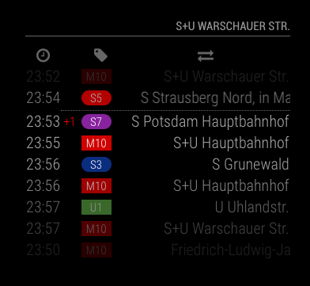

# MMM-PublicTransportBerlin

**MMM-PublicTransportBerlin** is a module for [MagicMirror²](https://github.com/MagicMirrorOrg/MagicMirror). It shows live public transport information for Berlin and Brandenburg based on [BVG HAFAS data](https://github.com/public-transport/hafas-client/blob/6/p/bvg/readme.md).

MMM-PublicTransportBerlin uses the [hafas-client](https://github.com/public-transport/hafas-client) with a BVG-specific profile by [derhuerst](https://github.com/derhuerst).

You can enter a delay time for "How long does it take to get to my station?". Then the module calculates the next reachable departures and draws a line between reachable and unreachable departures.

## Status

The current development status of this module is: **maintained**

This means: I'm open for feature requests, pull requests, bug reports, ...

## Screenshot

The module looks like this:



## Installation

Just clone the module into your MagicMirror modules directory and install the dependencies:

```shell
cd ~/MagicMirror/modules
git clone https://github.com/deg0nz/MMM-PublicTransportBerlin
cd MMM-PublicTransportBerlin
npm ci --omit=dev
```

## Update

Just enter your MMM-PublicTransportBerlin directory, pull the update and install the dependencies:

```shell
cd ~/MagicMirror/modules/MMM-PublicTransportBerlin
git pull
npm ci --omit=dev
```

## How to get the `stationId`

You need the `stationId` for the station whose departures should be displayed.

Here's how to find out the `stationId`:

1. You have to be in the modules directory (`~/MagicMirror/modules/MMM-PublicTransportBerlin`).
2. Then run the following command: `node --run query`.
3. Enter a station name.
4. The result could contain one or more possible stations with valid IDs.
5. Use the appropriate ID as `stationId` in the configuration of the module.

_Note:_ If you have used our instructions to get the `stationId` before March 2023, you certainly use long IDs (12 digits) in your config. We will be upgrading our main dependency (`hafas-client`) to version 6 in a few months. From this point on, the old (long) IDs will no longer work. We recommend that you switch to the short IDs now. Both short and long IDs currently work.

## Configuration

The module is quite configurable. These are the possible options:

<!-- prettier-ignore-start -->
| Option | Description |
|--------|-------------|
|`stationName`|The name of the station. This is used in the header of the module. If not set, the name fetched from the API will be used.<br><br>**Type:** `string` This value is **optional**.|
|`stationId`|The ID of the station. How to get the ID for your station is described below.<br><br>**Type:** `string` This value is **Required**.|
|`directionStationId`|If you want the module to show departures only in a specific direction, you can enter the ID of the next station on your line to specify the direction. <br><br> _Note: After some tests, the data delivery of this feature seems not to be as reliable as the normal version. Also, please make sure you actually have the right `stationId` for the direction station. Please check your MagicMirror log for errors before reporting them. <br> Additionally, more request results take more time for the request. So please make sure to keep your `maxUnreachableDepartures` and `maxReachableDepartures` low when using this feature._ <br><br> **Type:** `string` <br>**Default value:** `<empty>`|
|`ignoredLines`|You can exclude different lines of a station by adding them to this array. Usually, this can be empty.<br><br>**Type:** `string array` (comma separated `strings` in the array).<br>**Default value:** `<empty>` <br>**Possible values:** All valid line names like `'U5'` (for subway) , `'M10'` or `'21'` (for tram), `'S75'` (for suburban) , `'Bus 200'`(for bus), etc.|
|`excludeDirections`|You can exclude different directions of departure at a station by adding them to this array. Usually, this can be empty.<br><br>**Type:** `string array` (comma separated `strings` in the array).<br>**Default value:** `<empty>` <br>**Possible values:** All valid destinations like `'Charlottenburg, Hertzallee'`, `'Mariendorf, Forddamm'`, etc.|
|`excludedTransportationTypes`|Transportation types to be excluded from appearing on a module instance can be listed here.<br><br>**Type:** `string`, comma-separated list<br>**Default value:** `<empty>` <br>**Possible values:** `bus`, `tram`, `suburban`, `subway`, `regional`, `ferry`|
|`marqueeLongDirections`|Makes a marquee/ticker text out of all direction descriptions with more than `maxDirectionCharacterCount` (default 25) characters.<br><br> _Note: The rendering on the mirror is not perfect, but it is OK in my opinion. If the movement is not fluent enough for you, you should turn it off._<br><br>**Type:** `boolean`<br>**Default value:** `true`|
|`interval`|How often the module should be updated. The value is given in milliseconds.<br><br>**Type:** `integer` (milliseconds)<br>**Default value:** `120000` (2 minutes)|
|`hidden`|Visibility of the module.<br><br>**Type:** `boolean`<br>**Default value:** `false`|
|`travelTimeToStation`|How long does it take you to get from the mirror to the station? The value is given in minutes.<br><br>**Type:** `integer` (minutes)<br>**Default value:** `10` (10 minutes)|
|`departureMinutes`|For how many minutes in the future should departures be fetched? If `travelTimeToStation` is set > 0, then this time will be added to `now() + travelTimeToStation`. (This could be obsolete in future versions but is needed for now.)<br><br>**Type:** `integer` (minutes)<br>**Default value:** `10` (10 minutes)|
|`showColoredLineSymbols`|If you want the line colored and shaped or text only.<br><br>**Type:** `boolean`<br>**Default value:** `true`|
|`useColorForRealtimeInfo`|Set colors for realtime information<br><br>**Type:** `boolean`<br>**Default value:** `true`|
|`showTableHeaders`|Show or hides the table headers.<br><br>**Type:** `boolean`<br>**Default value:** `true`|
|`showTableHeadersAsSymbols`|Show the table headers as text or symbols.<br><br>**Type:** `boolean`<br>**Default value:** `true`|
|`maxUnreachableDepartures`|How many unreachable departures should be shown. Only necessary, of you set `travelTimeToStation` > 0<br><br>**Type:** `integer`<br>**Default value:** `3`|
|`maxReachableDepartures`|How many reachable departures should be shown. If your `travelTimeToStation = 0`, this is the value for the number of departures you want to see.<br><br>**Type:** `integer`<br>**Default value:** `7`|
|`fadeUnreachableDepartures`|Activates/deactivates fading for unreachable departures.<br><br>**Type:** `boolean`<br>**Default value:** `true`|
|`fadeReachableDepartures`|Activates/deactivates fading for reachable departures.<br><br>**Type:** `boolean`<br>**Default value:** `true`|
|`fadePointForReachableDepartures`|Fading point for reachable departures. This value is also valid for `travelTimeToStation == 0` <br><br>**Type:** `float`<br>**Default value:** `0.5` <br>**Possible values:** `0.0 - 1.0`|
|`excludeDelayFromTimeLabel`|The API provides time labels which include the delay time of the departure. This flag removes the delay time to show times like they are shown in the BVG-App.<br><br>**Type:** `boolean`<br>**Default value:** `false`|
|`animationSpeed`|Speed of the update animation. The value is given in milliseconds.<br><br>**Type:** `integer` (milliseconds)<br>**Default value:** `3000` (3 seconds)|
|`showDirection`|Shows the direction in the module instance's header if the module instance is directed.<br><br>**Type:** `boolean`<br>**Default value:** `true`|
|`useBrightScheme`|Brightens the display table.<br><br>**Type:** `boolean`<br>**Default value:** `false`|
|`shortenStationNames`|Whether to use [`vbb-short-station-name`](https://github.com/derhuerst/vbb-short-station-name) to shorten Station names.<br><br>**Type:** `boolean`<br>**Default value:** `true`|
|`showDistrictInDirections`|Whether to show the district (e.g. `Charlottenburg`) if the direction contains district and station (e.g. `Charlottenburg, Hertzallee`).<br><br>**Type:** `boolean`<br>**Default value:** `true`|
|`showStopNameInDirections`|Whether to show the stop name (e.g. `Hertzallee`) if the direction contains district and station (e.g. `Charlottenburg, Hertzallee`).<br><br>**Type:** `boolean`<br>**Default value:** `true`|
|`ignoreViaInDirections`|Whether to ignore via-stations in the direction (e.g. `U Walther-Schreiber-Platz via S Lankwitz` would get trimmed to `U Walther-Schreiber-Platz`.<br><br>**Type:** `boolean`<br>**Default value:** `true`|
|`headerPrefix`|Adds a prefix to the Header (e.g. `towards`). A blank will get added if set.<br><br>**Type:** `string` This value is **optional**.|
|`headerAppendix`|Adds a appendix to the Header (e.g. `towards`). A blank will get added if set.<br><br>**Type:** `string` This value is **optional**.|
|`replaceInDirections`|<p>An object defining strings which are to be replaced in the displayed directions.</p><p>**Type:** `object`<br>**Example:** `{ "Platz": "Pl.", "\\(TF\\)": ""}`<br>**Default value:** `{}`</p><p>**Note:** The strings which appear as the keys of the object will be replaced by their values. If you want to replace special symbols like `"("`, `")"` or `"-"` you must escape these characters by placing **two** `"\"` in front of the character (see example above).</p>|
|`noDeparturesText`|Overrides the default text for no departures.<br><br>**Type:** `string` This value is **optional**.|
|`noReachableDeparturesText`|Overrides the default text for no reachable departures.<br><br>**Type:** `string` This value is **optional**.|
|`noVBBDataText`|Overrides the default text for no VBB data.<br><br>**Type:** `string` This value is **optional**.|
|`fetchErrorText`|Overrides the default text for a fetch error.<br><br>**Type:** `string` This value is **optional**.|
|`maxDirectionCharacterCount`|Sets the maximum character count for a direction text. If the direction (after getting replaced and shortened is longer than this count, either the marquee effect is activated or the rest of the string is replaced with ...<br><br>**Type:** `integer`<br>**Default value:** `26`|
<!-- prettier-ignore-end -->

Here is an example of an entry in `config.js`:

```JavaScript
    {
        module: "MMM-PublicTransportBerlin",
        position: "top_right",
        config: {
            stationName: "Alexanderplatz",
            stationId: "900100003",
            hidden: false,
            ignoredLines: ["U5", "U8", "S75", "Bus 100"],
            excludeDirections: [""],
            excludedTransportationTypes: "bus,suburban,subway",
            travelTimeToStation: 10,
            interval: 120000,
            departureMinutes: 10,
            marqueeLongDirections: true,
            showColoredLineSymbols: true,
            useColorForRealtimeInfo: true,
            showTableHeaders: true,
            showTableHeadersAsSymbols: true,
            maxUnreachableDepartures: 3,
            maxReachableDepartures: 7,
            fadeUnreachableDepartures: true,
            fadeReachableDepartures: true,
            fadePointForReachableDepartures: 0.25,
            excludeDelayFromTimeLabel: true,
            useBrightScheme: true,
            showDistrictInDirections: true,
            showStopNameInDirections: true,
            ignoreViaInDirections: true,
            headerPrefix: "towards",
            headerAppendix: "S+U",
            replaceInDirections: {"Hauptbahnhof": "Hbf."},
            noDeparturesText: "no departures",
            noReachableDeparturesText: "no reachable departures",
            noVBBDataText: "no VBB data",
            fetchErrorText: "fetch error",
            maxDirectionCharacterCount: 20,
        }
    },
```

## Multiple Modules

Multiple instances of this module are possible. Just add another entry of MMM-PublicTransportBerlin to your `config.js`.

## Special Thanks

- [Michael Teeuw](https://github.com/MichMich) for inspiring me and many others to build a MagicMirror.
- [Jannis Redmann](https://github.com/derhuerst) for creating the [hafas-client](https://github.com/public-transport/hafas-client).
  You made my life a lot easier with this! Please consider supporting him on [Patreon](https://patreon.com/derhuerst)!
- The community of [magicmirror.builders](https://magicmirror.builders) for help in the development process and all contributors for finding and fixing errors in this module.

## Contributing

If you find any problems, bugs or have questions, please [open a GitHub issue](https://github.com/deg0nz/MMM-PublicTransportBerlin/issues) in this repository.

Pull requests are of course also very welcome 🙂

### Code of Conduct

Please note that this project is released with a [Contributor Code of Conduct](CODE_OF_CONDUCT.md). By participating in this project you agree to abide by its terms.

### Developer commands

- `npm install` - Install all dependencies.
- `node --run demo` - Run a demo config with MagicMirror.
- `node --run lint` - Run linting and formatter checks.
- `node --run lint:fix` - Fix linting and formatter issues.
- `node --run release` - Create a new release. (Bumps version, creates changelog, commits, tags)
- `node --run test` - Run linting and formatter checks + Run spelling check.
- `node --run test:spelling` - Run spelling check.

## License

This project is licensed under the MIT License - see the [LICENSE](LICENSE.md) file for details.

## Changelog

All notable changes to this project will be documented in the [CHANGELOG.md](CHANGELOG.md) file.
